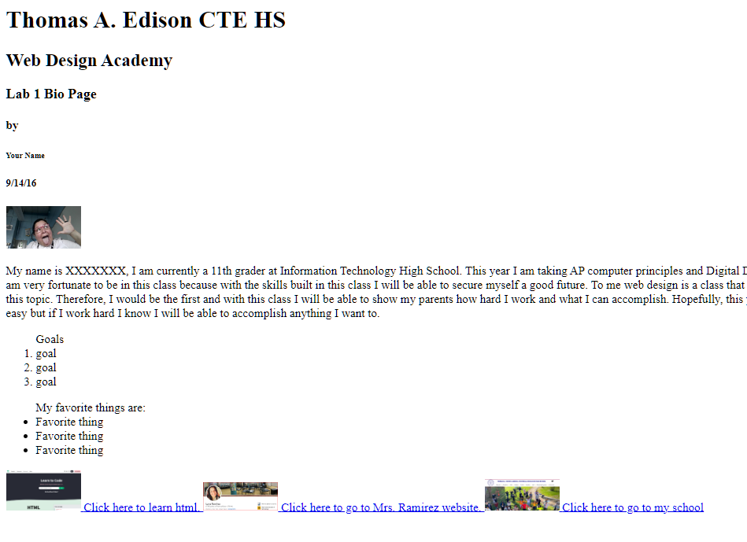

## The challenge

You will create a personal web page. You will :
**Create the HTML document**
**Title**
**Headings h1 - h6**
**Paragraphs**
**Unordered HTML List**
**Ordered HTML List**
**Image**
**Hyperlinks**

If you run into trouble :
🔎Look at each line carefully.
🐞Can you fix the bug(s)? 

### Start Here
1. Use headings to display :
   Thomas A. Edison HS.
   Web Development Class.
   Lab #insert title of lab
   Your Full Name
   Date
  
2. Write a brief students bio.
3. List 3 of you favorite things
4. Include a picture of yourself
5. List 3 goals in order of importance.
6. Add a text link to Thomas A. Edison HS.*taehs.org*
7. Add a Image link to Mrs. Ramirez site.*techteach.us*
8. Add a link to *w3schools.com*
9. Refer to the **code clips** below to help you fix the errors.

   ✅Right click on your code and add a comment explaining what was  problems did you encounter and how you solved them. 

  3. You can use Google to find the code you need.

🏁 Once you have created the your Intro Page and added comments submit to your teacher.

## Use code clips to help you.
## here is a sample of what it would look like
